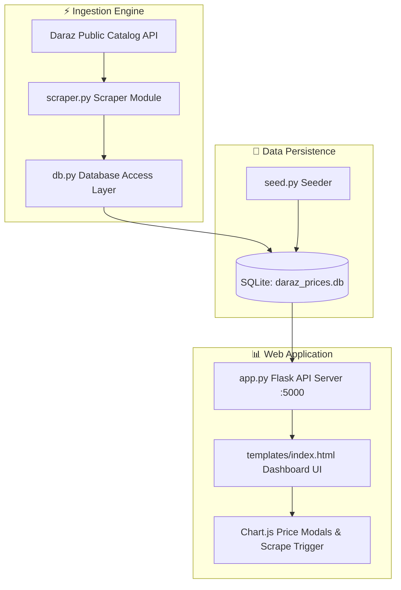

# 🛍️ Daraz Analytics & Price Tracker

> **Uncapped Public API Scraper, Normalized Unit Price Forensics & Historical Price Tracker for Daraz Bangladesh.**

[](https://ranehal.github.io/DARAZ-analytics/)
[](https://www.python.org/)
[](https://flask.palletsprojects.com/)
[](https://www.sqlite.org/)
[](LICENSE)

---

## 📌 Executive Summary

**DARAZ Analytics** is a price tracking and market intelligence platform for [Daraz Bangladesh](https://www.daraz.com.bd), Bangladesh's largest e-commerce marketplace (owned by Alibaba Group).

Operating in a CamelCamelCamel-style format, the platform queries public Daraz catalog APIs dynamically across all major categories, tracks price volatility, calculates normalized unit pricing (e.g., `৳/kg`, `৳/L`, `৳/pc`), monitors seller ratings, and visualizes price drop opportunities through a Flask dashboard.

---

## 🚀 Key Features

- **🌐 Uncapped Catalog Scraper**: Dynamically crawls public Daraz catalog APIs across all top-level and nested subcategories.
- **📊 Normalized Unit Price Calculations**: Automatically parses product names and quantities to compute real unit value (e.g., `৳/kg`, `৳/liter`, `৳/piece`).
- **🏷️ Historical Price & Discount Analytics**: Logs original vs discounted prices, seller rating metrics, and All-Time Low (ATL) price drops.
- **🖥️ Flask Interactive Dashboard**: Features full-text product search, category navigation trees, live scrape triggers, and price modal analytics.
- **⚡ Batch Launcher Script (`runall.bat`)**: Windows launcher script for automated database seeding, scraping, and dashboard execution.

---

## 🏗️ System Architecture



---

## 📁 Repository Structure

```
DARAZ/
├── app.py              # Flask API server & web application routes
├── db.py               # SQLite database access layer & schema management
├── scraper.py          # Daraz public catalog API scraper module
├── seed.py             # Database seeder for initializing sample datasets
├── runall.bat          # Windows batch launcher script
├── daraz_prices.db     # SQLite price database storage
├── requirements.txt    # Python dependencies (Flask, requests)
└── templates/
    └── index.html      # Interactive analytics dashboard UI markup
```

---

## 🛠️ Usage & Local Setup

### 1. Install Dependencies
```bash
pip install -r requirements.txt
```

### 2. Database Initialization & Seeding (Optional)
To seed initial datasets or reset existing data:
```bash
python seed.py
```

### 3. Execute Scraper CLI
```bash
# Scrape catalog up to 10 pages per category
python scraper.py --pages 10
```

### 4. Start Dashboard Web Server
```bash
python app.py
```
Open `http://localhost:5000` in your web browser.

---

## 📜 License

Distributed under the MIT License. Trademarks and data belong to Daraz / Alibaba Group. Built for analytical purposes.
