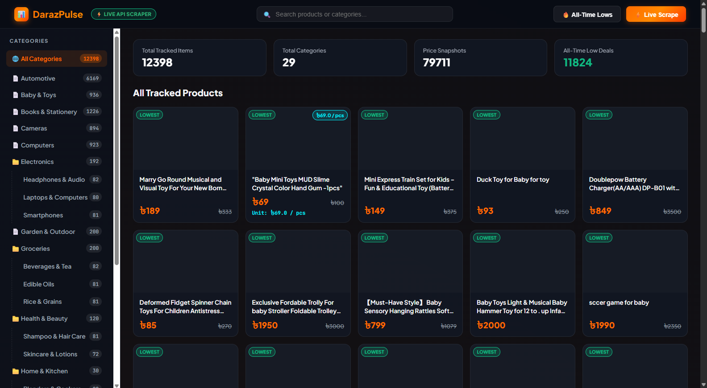
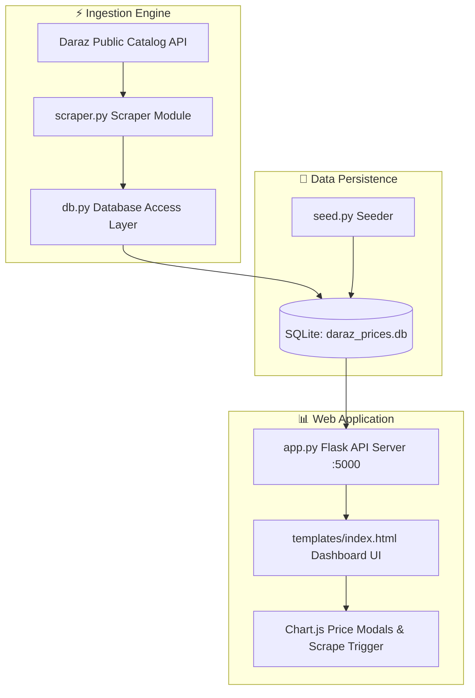

# 🛍️ Daraz Analytics & Price Tracker

> **Uncapped Public API Scraper, Normalized Unit Price Forensics & Historical Price Tracker for Daraz Bangladesh.**

[](https://ranehal.github.io/DARAZ-analytics/)
[](https://www.python.org/)
[](https://flask.palletsprojects.com/)
[](https://www.sqlite.org/)
[](LICENSE)

---

## 📌 Executive Summary

**DARAZ Analytics** is a price tracking and market intelligence platform for [Daraz Bangladesh](https://www.daraz.com.bd), Bangladesh's largest e-commerce marketplace (owned by Alibaba Group).

Operating in a CamelCamelCamel-style format, the platform queries public Daraz catalog APIs dynamically across all major categories, tracks price volatility, calculates normalized unit pricing (e.g., `৳/kg`, `৳/L`, `৳/pc`), monitors seller ratings, and visualizes price drop opportunities through a Flask dashboard.

---

## 🚀 Key Features

- **🌐 Uncapped Catalog Scraper**: Dynamically crawls public Daraz catalog APIs across all top-level and nested subcategories.
- **📊 Normalized Unit Price Calculations**: Automatically parses product names and quantities to compute real unit value (e.g., `৳/kg`, `৳/liter`, `৳/piece`).
- **🏷️ Historical Price & Discount Analytics**: Logs original vs discounted prices, seller rating metrics, and All-Time Low (ATL) price drops.
- **🖥️ Flask Interactive Dashboard**: Features full-text product search, category navigation trees, live scrape triggers, and price modal analytics.
- **⚡ Batch Launcher Script (`runall.bat`)**: Windows launcher script for automated database seeding, scraping, and dashboard execution.

---

## 📸 Screenshots

> Captured from a live localhost run of the dashboard.

| Dashboard |
| :---: |
|  |

---

## 🏗️ System Architecture



---

## 📁 Repository Structure

```
DARAZ/
├── app.py              # Flask API server & web application routes
├── db.py               # SQLite database access layer & schema management
├── scraper.py          # Daraz public catalog API scraper module
├── seed.py             # Database seeder for initializing sample datasets
├── runall.bat          # Windows batch launcher script
├── daraz_prices.db     # SQLite price database storage
├── requirements.txt    # Python dependencies (Flask, requests)
└── templates/
    └── index.html      # Interactive analytics dashboard UI markup
```

---

## 🛠️ Usage & Local Setup

### 1. Install Dependencies
```bash
pip install -r requirements.txt
```

### 2. Database Initialization & Seeding (Optional)
To seed initial datasets or reset existing data:
```bash
python seed.py
```

### 3. Execute Scraper CLI
```bash
# Scrape catalog up to 10 pages per category
python scraper.py --pages 10
```

### 4. Start Dashboard Web Server
```bash
python app.py
```
Open `http://localhost:5000` in your web browser.

---

## 🚀 Future Work — Production-Grade Roadmap

The following roadmap outlines the engineering steps required to evolve **DARAZ Analytics** from a local/research tool into a polished, industrial-grade product:

### 1. Architecture & Infrastructure
- **Containerization & Orchestration**: Package scraper + Flask API + dashboard as Docker images; deploy with `docker-compose` locally and Kubernetes (EKS/GKE) for horizontal scaling.
- **Managed Databases**: Migrate from the local `daraz_prices.db` SQLite file to a managed PostgreSQL (RDS/Cloud SQL) with partitioning for daily price snapshots and connection pooling (PgBouncer).
- **Production Web Framework**: Upgrade the Flask dev server to a production ASGI stack (FastAPI/uvicorn or Gunicorn+gevent) with typed endpoints, OpenAPI docs, and async DB drivers.
- **Broker-Backed Ingestion**: Replace in-process scraping with a resilient pipeline using Redis Streams / Kafka with retries, dead-letter queues, and resumable checkpoints.
- **Object Storage + CDN**: Store product images and raw daily snapshots in S3/Cloudflare R2 with a CDN; enforce lifecycle policies for archival.
- **Caching Layer**: Redis for hot queries (stats, categories, products) with TTL invalidation; ETag/If-Modified-Since on all API responses.

### 2. Reliability & Observability
- **Structured Logging & Tracing**: JSON structured logging with correlated request IDs and OpenTelemetry tracing across scraper → queue → DB → API.
- **Metrics & Alerting**: Prometheus metrics (scrape success rate, latency percentiles, job durations) + Grafana dashboards + PagerDuty/AlertManager alerts.
- **SLOs & Health Checks**: `/health`, `/ready` endpoints; scraper watchdog that auto-recovers from stuck sessions; idempotent job resumption.
- **Automated Testing**: Unit tests for unit-price parsing and delta compression; integration tests with recorded fixtures; end-to-end Playwright tests for the dashboard.

### 3. Security & Compliance
- **Secret Management**: Move all credentials into a vault (AWS Secrets Manager / HashiCorp Vault / Doppler) — never baked into images or repos.
- **Auth & Rate Limiting**: API-key/JWT-based access control with per-tenant rate limiting; TLS everywhere; dependency scanning (Snyk/Dependabot) and SBOM generation.
- **Respectful Crawling**: robots.txt compliance, domain-wide polite rate limiting, exponential backoff, and traffic shaping to avoid impacting the upstream service.

### 4. Data Platform & Analytics
- **Warehouse & BI**: Land normalized datasets into a columnar warehouse (ClickHouse/BigQuery) with dbt transformations; build Looker/Metabase dashboards.
- **Streaming Prices**: Migrate daily batch snapshots to near-real-time streaming (Kafka → Flink/Spark) for live price movement detection.
- **ML / Forecasting**: Add time-series forecasting (Prophet/ARIMA/LightGBM) for price prediction, anomaly detection on drops, and personalized deal recommendations.

### 5. Product & UX
- **User Accounts & Sync**: OAuth2 accounts, cross-device watchlists/alerts, and email/push notifications (SendGrid/FCM) when target prices are hit.
- **Public API & Docs**: Versioned, documented public REST API (OpenAPI) with rate limits and developer keys; optional GraphQL gateway.
- **Localization & Accessibility**: Full i18n (bn/en), WCAG 2.1 AA compliance, dark/light theming consistency, and mobile-first responsive PWA with offline mode.
- **Performance Budget**: Code-splitting, virtualized product lists, lazy-loaded charts, and Lighthouse budgets enforced in CI (CLS < 0.1, LCP < 2.5s).

---

## 📜 License

Distributed under the MIT License. Trademarks and data belong to Daraz / Alibaba Group. Built for analytical purposes.
