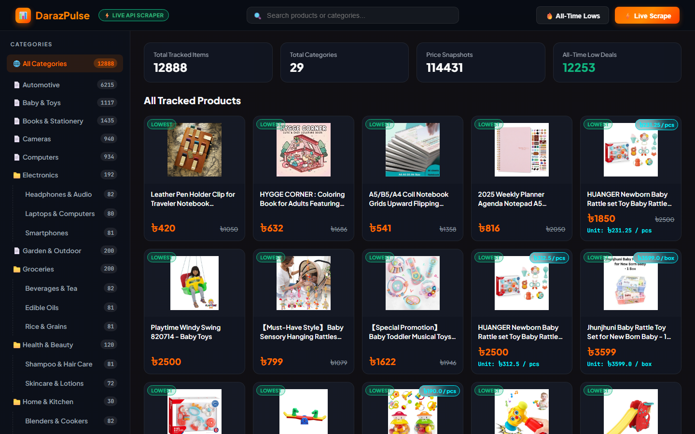

# Daraz Analytics — E-Commerce Price History & Market Intelligence

Comprehensive price trend tracking, discount analyzer, flash-sale monitor, and
campaign/fest tracker for Daraz Bangladesh.

---

## 🌐 Dashboard & Live Preview



---

## ✨ What's Inside

A **multi-section intelligence dashboard** (`templates/index.html`, also served
statically as `index.html` for GitHub Pages):

- **Overview** — live flash sales, active fests/campaigns, and biggest price drops.
- **Flash Sales** — items harvested straight from the Daraz homepage SSR payload.
- **Fests & Campaigns** — every active sale/fest/voucher section (11.11, Eid, Mall Fest…).
- **Deals & Drops** — biggest price drops, top discounts, best sellers, 7-day movers.
- **Analytics** — category distribution & discount-distribution charts (Chart.js).
- **All Products** — search, sort (price/discount/rating), all-time-low filter, CSV export.

## 🛠️ Architecture

| Layer | File | Purpose |
|-------|------|---------|
| **Discovery** | `discovery.py` | Scrapling-powered harvesting of categories, flash sales & campaign sections |
| **Scraper** | `scraper.py` | Uncapped category product scraping (live API, threaded) |
| **DB** | `db.py` | SQLite store: products, price_history, campaigns, flash_sales + analytics queries |
| **API** | `app.py` | Flask REST API + CSV export |
| **Static** | `export_static.py` | Emits JSON for GitHub Pages hosting |
| **Config** | `config.py` | Central constants & known-campaign registry |

### Discovery via Scrapling
`discovery.py` uses [Scrapling](https://github.com/D4Vinci/Scrapling) with stealthy
TLS impersonation to harvest the Daraz homepage SSR payload, extracting:
- **Flash-sale cards** (price, original, discount %, sold count, clean URL)
- **Campaign / fest / voucher links** (classified by slug)
- **Category chips** (real category IDs & names)

It **gracefully falls back to plain `requests`** when Scrapling isn't installed, so
the Kaggle orchestrator (which clones this repo and runs `scraper.py`) never breaks.

## ⚡ Run

```bash
pip install -r requirements.txt

# Full scrape (categories + discovery + products + export)
python scraper.py --pages 100

# Refresh categories & discovery only
python scraper.py --categories-only

# Serve the Flask dashboard
python app.py           # → http://localhost:5000

# Or serve the static export
python export_static.py
python -m http.server 8000
```

## 🗄️ Database

SQLite (`daraz_prices.db`) with WAL mode. Tables: `categories`, `products`,
`price_history`, `campaigns`, `flash_sales`. Analytics helpers include price drops,
top discounts, best sellers, price movers, category/discount distributions.
